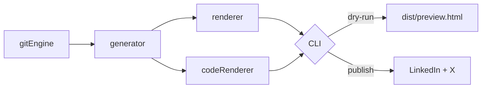

# CommitCast

**Ship the work. Stop rewriting the commit.**

CommitCast turns your latest git commit into a LinkedIn post, an X thread, and a visual architecture diagram — from one command.

```bash
npx commitcast
```

If you build in public, you already know the tax: every meaningful commit deserves an update, and writing that update by hand is the part that never makes the sprint. CommitCast reads the repo, the diff, and the README, then drafts technical marketing copy you can preview, edit, or publish.

---

## The problem

Engineers do the work. Then they lose an hour translating a diff into something humans will actually read.

- Commit messages are for git, not for LinkedIn.
- Architecture changes live in the patch, not in a diagram.
- “I’ll post about this later” is how shipping in public dies.

CommitCast is the missing step between `git commit` and “here’s what we shipped.”

---

## 30-second quickstart

Requires **Node.js 20+** and a git repo with at least one commit.

```bash
# 1. Drop env vars in the repo root
cp .env.example .env

# 2. Preview locally — nothing is published
npx commitcast --dry-run

# 3. When the copy looks right, publish
npx commitcast
```

That’s it. CommitCast will:

1. Ingest the latest commit, truncated diff, README, and `package.json`
2. Generate a LinkedIn post, X thread, and Mermaid diagram with Claude 3.5 Sonnet
3. Render `dist/commit-diagram.png` and `dist/code-card.png`
4. Show a preview, then ask **Publish Now / Regenerate / Cancel**

Dry-run skips LinkedIn and X, writes `dist/preview.html`, and opens it in your browser.

---

## Feature matrix

| Feature | What you get |
|---|---|
| **Local CLI** | Interactive `npx commitcast` with platform checkboxes and regenerate-before-publish |
| **Dry-run preview** | Dark-mode `dist/preview.html` with social cards, diagram, and code snippet — no network publish |
| **Git hooks** | Run CommitCast on every commit via `.git/hooks/post-commit` |
| **GitHub Actions** | Auto-draft (or auto-publish) on push with `--yes` and repo secrets |
| **Visual diagrams** | Mermaid architecture PNGs plus a Carbon-style diff card from the hunk that actually changed |

### Flags

| Flag | Purpose |
|---|---|
| `-d`, `--dry-run` | Generate assets + HTML preview; never call LinkedIn or X |
| `-y`, `--yes` | Skip prompts and publish to every configured platform (hooks / CI) |

```bash
npx commitcast --dry-run
npx commitcast --yes
```

---

## Environment variables

Copy `.env.example` to `.env` in the repo you want to post from. CommitCast reads secrets from `process.env` only — it never logs token values.

| Variable | Required for | Notes |
|---|---|---|
| `ANTHROPIC_API_KEY` | Generation | Claude 3.5 Sonnet (`claude-3-5-sonnet-20241022`) |
| `LINKEDIN_CLIENT_ID` | LinkedIn OAuth app | Developer app client ID |
| `LINKEDIN_CLIENT_SECRET` | LinkedIn OAuth app | Developer app secret (never commit) |
| `LINKEDIN_ORGANIZATION_URN` | LinkedIn company publish | `urn:li:organization:86663814` or the numeric company id |
| `LINKEDIN_ACCESS_TOKEN` | LinkedIn publish | Member OAuth token with `w_organization_social` |
| `LINKEDIN_PERSON_URN` | LinkedIn personal publish | Optional fallback if no organization URN is set |
| `TWITTER_API_KEY` | X publish | OAuth 1.0a app key |
| `TWITTER_API_SECRET` | X publish | OAuth 1.0a app secret |
| `TWITTER_ACCESS_TOKEN` | X publish | User access token |
| `TWITTER_ACCESS_SECRET` | X publish | User access secret |

Generation needs only `ANTHROPIC_API_KEY`. Publishing is per-platform: if you skip X in the checkbox, Twitter credentials are unused.

For CI, set the same names as GitHub Actions secrets. Do not commit `.env`.

---

## ZocLabs / Ittisal

CommitCast lives under **[ZocLabs](https://github.com/ZocLabs)** and posts to the Ittisal company page (`urn:li:organization:86663814`). Product copy is grounded in the CCaaS platform and marketing site:

- Platform: [ZocLabs/ittisal](https://github.com/ZocLabs/ittisal) — AI-native agentic CCaaS (`ittisal.app` / `hub.ittisal.app`)
- Marketing site: [ZocLabs/Ittisal_Website](https://github.com/ZocLabs/Ittisal_Website) — public site at [ittisal.app](https://ittisal.app)

### LinkedIn OAuth on Vercel

The LinkedIn developer app needs an HTTPS redirect. CommitCast exposes that on Vercel:

1. Open `/api/linkedin/start` on the deployed project
2. Approve organization posting as an Ittisal admin
3. Copy `LINKEDIN_ACCESS_TOKEN` from `/api/linkedin/callback` into local `.env` (never commit it)

Add this exact redirect URL in the LinkedIn app **Auth** tab:

```
https://<your-vercel-host>/api/linkedin/callback
```

Enable the Community Management / organization posting products so the app can request `w_organization_social`.

Optional: set `LINKEDIN_REDIRECT_URI` on Vercel if you pin a custom domain.

---

## Architecture

CommitCast is a short pipeline, not a platform.



**1. Context ingestion** (`src/gitEngine.ts`)  
`getRepoContext()` uses `simple-git` to read `HEAD`: hash, message, author, changed files, and `git show` patch. README and `package.json` supply product name and framing. Diffs are capped at **4,000 characters** before they ever touch the model.

**2. LLM orchestration** (`src/generator.ts`)  
`generateSocialAssets()` calls the Vercel AI SDK `generateObject` API with Anthropic Claude 3.5 Sonnet. A Zod schema enforces:

- `linkedInPost` — technical, high-signal, hashtags
- `xThread` — 2–8 tweets, each ≤ 280 characters
- `mermaidDiagram` — raw flowchart/sequence syntax, no markdown fences

**3. Diagram and snippet rendering**  
- `renderMermaidToPng()` writes a temp `.mmd` and shells `npx mmdc` → `dist/commit-diagram.png`
- `renderCodeCard()` extracts the densest 10–15 diff lines and snapshots a dark Mac-style card with Playwright → `dist/code-card.png`

**4. Publish or preview** (`src/publishers/socialPublisher.ts`, `src/index.ts`)  
X uses `twitter-api-v2` (`v1.uploadMedia` + `v2.tweetThread`). LinkedIn uses the Assets + UGC Posts APIs via axios. `--dry-run` never calls those functions.

---

## Automate it

### Git hook

```bash
# .git/hooks/post-commit
#!/bin/sh
npx commitcast --dry-run
```

Swap `--dry-run` for `--yes` only after you trust the output. Make the hook executable:

```bash
chmod +x .git/hooks/post-commit
```

### GitHub Actions

```yaml
# .github/workflows/commitcast.yml
name: CommitCast
on:
  push:
    branches: [main]

jobs:
  cast:
    runs-on: ubuntu-latest
    steps:
      - uses: actions/checkout@v4
        with:
          fetch-depth: 2
      - uses: actions/setup-node@v4
        with:
          node-version: "20"
      - run: npx --yes commitcast --dry-run
        env:
          ANTHROPIC_API_KEY: ${{ secrets.ANTHROPIC_API_KEY }}
```

Use `--yes` instead of `--dry-run` when you are ready to publish from CI, and add the LinkedIn / X secrets to the `env` block.

---

## Local development

```bash
npm install
npx playwright install chromium
cp .env.example .env
npm start -- --dry-run
npm test
npm run build
```

`npm run preview` is an alias for `tsx src/index.ts --dry-run`.

---

## License

MIT
